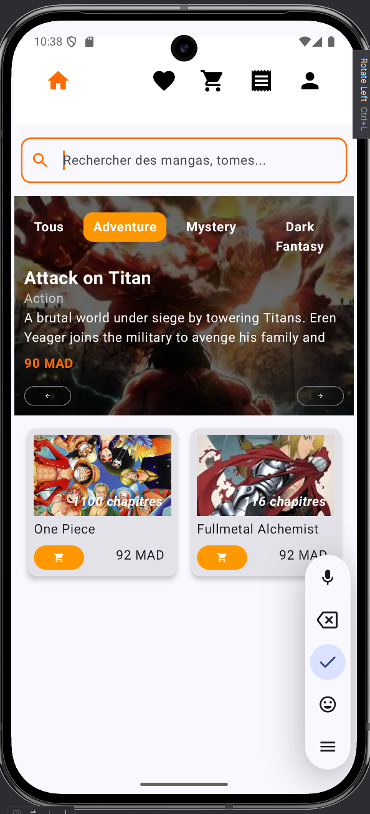

# MangaLighter - Application mobile e-commerce de mangas

**Auteur** : Salwa Elghailani  
**Master** : DevOps et Cloud Computing  
**Année Universitaire** : 2024/2025  
**Encadré par** : Pr. KOUISSI Mohamed  
**Établissement** : Faculté Polydisciplinaire de Larache, Maroc  

---

## Table des matières
1. [Introduction](#introduction)
2. [Technologies utilisées](#technologies-utilisées)
3. [Architecture du projet](#architecture-du-projet)
4. [Mise en œuvre de l’application mobile](#mise-en-œuvre-de-lapplication-mobile)
4. [Fonctionnalités implémentées](#fonctionnalités-implémentées)
5. [Perspectives](#perspectives)
6. [Guide d'installation](#guide-dinstallation)

---

## Introduction

MangaLighter est une application mobile Android pour la vente de mangas physiques.  
Développée avec Jetpack Compose et Kotlin, elle offre une expérience utilisateur fluide et moderne adaptée aux passionnés de mangas.

Objectifs principaux :  
- Offrir une interface intuitive et rapide sur mobile  
- Gérer efficacement les commandes et le panier  
- Assurer la sécurité et confidentialité des données utilisateurs

---

## Technologies utilisées

- **Kotlin** : Langage principal de développement
- **Jetpack Compose** : Framework UI moderne pour Android
- **Android Studio** : IDE officiel
- **Room** (optionnel) : Base locale pour gestion des données
- **Retrofit** : Appels API simulés
- **Hilt (Dagger)** : Injection de dépendances
- **Navigation Compose** : Navigation entre écrans

---
## Architecture du projet


---
## Mise en œuvre de l’application mobile

Cette section présente les interfaces clés de l’application, à travers des **captures d’écran** et des **descriptions fonctionnelles**.

### 4.1 Écran d’accueil / Catalogue

- Barre de navigation en haut (Accueil, Favoris, Panier, Commandes, Profil)
- Barre de recherche toujours visible
- Bannières dynamiques avec mangas populaires
- Filtres par genre sous forme de tags (Action, Drame…)
- Liste de mangas affichés sous forme de cartes avec :
   - Image couverture
   - Titre
   - Prix
   - Nombre de chapitres
   - Bouton d’ajout au panier


 

###  4.2 Filtrage par genre

- Affichage horizontal des catégories sous la barre de recherche
- Mise à jour instantanée du catalogue selon le filtre sélectionné

 

---

### 4.3 Recherche par nom

- Saisie dynamique dans le champ de recherche
- Résultats filtrés en temps réel


---

###  4.4 Fiche produit

- Détails du manga : image, résumé, prix, genre, auteur, stock ...
- Boutons "Ajouter au panier" et "Ajouter aux favoris"


---

### 4.5 Favoris

- Liste personnalisée des mangas favoris
- Icône de suppression simple
- Affichage similaire au catalogue

 

---

###  4.6 Panier

- Double affichage : liste + récapitulatif total
- Sélection des articles par double click
- Bouton "Commander" activé uniquement après validation


---

###  4.7 Passage de commande

- Sélection des chapitres par cases à cocher
- Informations client (adresse, téléphone)
- Choix du mode de paiement (en ligne ou livraison)
- Total mis à jour dynamiquement

 

---

### 4.8 Historique des commandes

- Détail complet des commandes
- Suivi des statuts
- Possibilité d’annuler les commandes "En attente"

 

---

###  4.9 Profil

- Photo, nom, email
- Bouton "Modifier profil"
- Boutons de déconnexion et menu contextuel


---

###  4.10 Connexion

- Champs : email, mot de passe
- Messages d’erreur intégrés
- Lien vers inscription

 

---

### ✍4.11 Inscription

- Formulaire clair avec validation
- Message de confirmation
- Redirection automatique vers la connexion


---
### 4.12 Internationalization (i18n) Support
MangaLighter supports multiple languages to provide a localized user experience. Currently, the application supports:

- English
  
- Arabic
  
##  Fonctionnalités implémentées

- Catalogue dynamique de mangas
- Recherche par mot-clé
- Filtres par genre
- Favoris
- Panier
- Commande complète avec suivi
- Authentification et profil utilisateur

---

##  Perspectives

- Connexion à une base de données avec backend Node.js
- API REST sécurisées
- Notifications push pour commandes
- Paiement en ligne (Stripe / PayPal)
- Tests unitaires et CI/CD

---

## Guide d'installation

### Prérequis

- Android Studio Arctic Fox ou supérieur  
- SDK Android (API 21+)  
- Kotlin 1.7+  

### Lancer l'application

1. Cloner le dépôt :  
   ```bash
   git clone https://github.com/SqalwaElghailani/Projet-Android-ElghailaniSalwa.git
